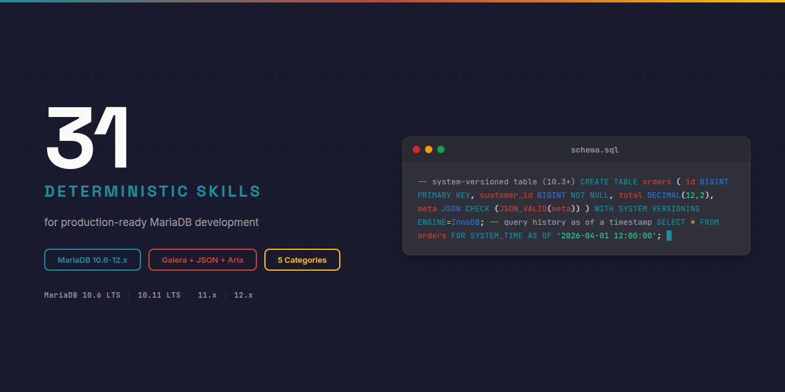

# MariaDB : Claude Skill Package

<p align="center">
  
</p>


**31 deterministic Claude AI skills for MariaDB : storage engines, schema design, indexing, query optimization, replication, Galera clustering, JSON, backup and restore, security, and MySQL to MariaDB migration. Companion to the Frappe / ERPNext skill package.**

Built on the [Agent Skills](https://agentskills.org) open standard. Discoverable via npm-agentskills manifest and OpenAI Codex skill discovery.

## Why This Exists

Without skills, Claude lacks deterministic guidance for MariaDB patterns:

```sql
-- Wrong : assumes MariaDB JSON is binary like MySQL 5.7+
-- In MariaDB, JSON is an alias for LONGTEXT — no native binary storage,
-- no validation unless you add a CHECK constraint.
ALTER TABLE products ADD COLUMN meta JSON;
INSERT INTO products (meta) VALUES ('not even valid json');  -- silently accepted
```

With this skill package, Claude produces correct patterns:

```sql
-- Correct : enforce JSON validity with CHECK constraint (MariaDB-specific)
-- and use the dedicated JSON_* functions which work on the LONGTEXT storage.
ALTER TABLE products
  ADD COLUMN meta JSON CHECK (JSON_VALID(meta));

-- Functional indexing on JSON path (MariaDB 10.3+) avoids full table scans
ALTER TABLE products
  ADD INDEX idx_brand ((JSON_VALUE(meta, '$.brand')));
```

## What's Inside

| Category | Count | Purpose |
|----------|:-----:|---------|
| **core/** | 6 | Architecture, storage engines, replication model, security, versions, defaults |
| **syntax/** | 10 | SQL DML / DDL, indexing, JSON, dynamic columns, window functions, temporal tables, routines |
| **impl/** | 7 | Schema design, query optimization, replication, Galera, backup, tuning, migration |
| **errors/** | 5 | Deadlocks, replication lag, Galera conflicts, slow queries, encoding |
| **agents/** | 3 | Schema review, query optimization, migration validation |
| **Total** | **31** | |

See [INDEX.md](INDEX.md) for the complete skill catalog with descriptions and the dependency graph.

## Installation

### Claude Code (recommended)

```bash
# Clone the full package
git clone https://github.com/OpenAEC-Foundation/MariaDB-Claude-Skill-Package.git
cp -r MariaDB-Claude-Skill-Package/skills/source/ ~/.claude/skills/mariadb/
```

### As git submodule

```bash
git submodule add https://github.com/OpenAEC-Foundation/MariaDB-Claude-Skill-Package.git .claude/skills/mariadb
```

### Via npm-agentskills standard

```bash
npx skills add @openaec/mariadb-claude-skill-package
```

### Claude.ai (web)

Upload individual SKILL.md files as project knowledge.

## Skill Structure

Every skill follows 3-level progressive disclosure:

```
mariadb-{category}-{topic}/
├── SKILL.md              # Main guidance (< 500 lines)
└── references/
    ├── methods.md        # Complete API signatures
    ├── examples.md       # Working code examples
    └── anti-patterns.md  # What NOT to do (with explanations)
```

YAML frontmatter uses folded scalar `>`, "Use when..." opener, and a `Keywords:` line with technical + symptom-based + plain-language terms for maximum discoverability.

## Quality Guarantees

- **Deterministic language** : ALWAYS / NEVER, no "you might consider"
- **Version-explicit code** : every example annotated with applicable versions
- **WebFetch-verified** : all code-snippets validated against official docs
- **CI/CD validated** : frontmatter, line count, structure, language, em-dash checks on every push
- **Compliance audit** : score >= 90% required for releases

## Companion Skills : Cross-Technology Integration

MariaDB is the default database for Frappe / ERPNext, runs in Docker containers, and backs Nextcloud. The `mariadb-impl-schema-design` skill includes a dedicated Frappe / ERPNext table-naming companion section.

For projects combining MariaDB with other AEC technologies, see [Cross-Tech-AEC-Claude-Skill-Package](https://github.com/OpenAEC-Foundation/Cross-Tech-AEC-Claude-Skill-Package) and the [Frappe Claude Skill Package](https://github.com/OpenAEC-Foundation/Frappe_Claude_Skill_Package).

## Related Skill Packages (OpenAEC Foundation)

| Package | Skills | Repo |
|---------|--------|------|
| Blender-Bonsai-ifcOpenshell-Sverchok | 73 | [Link](https://github.com/OpenAEC-Foundation/Blender-Bonsai-ifcOpenshell-Sverchok-Claude-Skill-Package) |
| Frappe | 61 | [Link](https://github.com/OpenAEC-Foundation/Frappe_Claude_Skill_Package) |
| Speckle | 25 | [Link](https://github.com/OpenAEC-Foundation/Speckle-Claude-Skill-Package) |

See full list at [OpenAEC-Foundation](https://github.com/OpenAEC-Foundation).

## License

MIT : OpenAEC Foundation

## Contributing

See [CONTRIBUTING.md](CONTRIBUTING.md). Built with the [Skill Package Workflow Template](https://github.com/OpenAEC-Foundation/Skill-Package-Workflow-Template) methodology.
